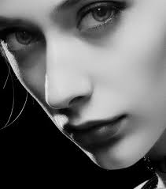

# DICES

Turns a picture into dice faces, can be used to make a 'painting' of dices.
Import the picture you want to turn into a dice-made picture, choose the size of the dice painting, download, enjoy !

Examples
==============

## Colour picture

## Black and white picture

